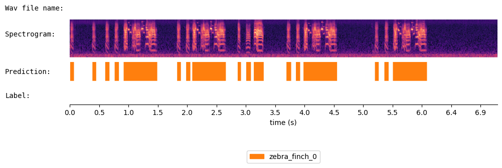
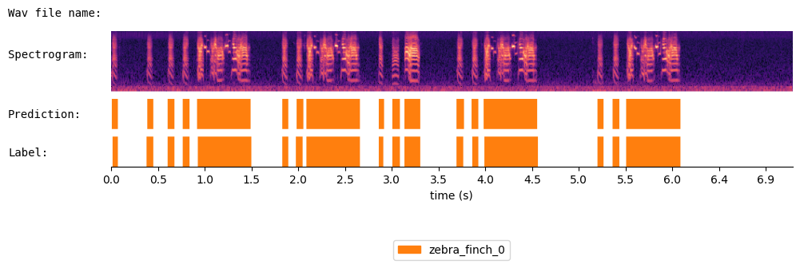

# Positive Transfer Of The Whisper Speech Transformer To Human And Animal Voice Activity Detection
We proposed **WhisperSeg**, utilizing the Whisper Transformer pre-trained for Automatic Speech Recognition (ASR) for both human and animal Voice Activity Detection (VAD). For more details, please refer to our paper:
> [**Positive Transfer of the Whisper Speech Transformer to Human and Animal Voice Activity Detection**](https://doi.org/10.1101/2023.09.30.560270)
> 
> Nianlong Gu, Kanghwi Lee, Maris Basha, Sumit Kumar Ram, Guanghao You, Richard H. R. Hahnloser <br>
> University of Zurich and ETH Zurich

*Accepted to the 2024 IEEE International Conference on Acoustics, Speech and Signal Processing (ICASSP 2024)*

## Install Environment
### Method 1: Install using environment.yml
```bash
conda env create -f environment.yml
```
### Method 2: Install via pip
```bash
conda create -n wseg python=3.10 -y
conda activate wseg
pip install -r requirements.txt
conda install -c pypi cudnn -y
```

**NOTE:** For method 1 and 2, if running WhisperSeg on windows, one need to further uninstall 'bitsandbytes' by 
```bash
pip uninstall bitsandbytes
```
and then install 'bitsandbytes-windows==0.37.5'
```bash
pip install bitsandbytes-windows==0.37.5
```

### Method 3 (only for Linux): 
Directly download the packed anaconda environment at https://huggingface.co/datasets/nccratliri/whisperseg-conda-env/blob/main/wseg.tar.gz
uncompress it by
```bash
mkdir wseg
tar -xzvf wseg.tar.gz -C wseg/
```
and put the unzipped folder 'wseg' to the path '~/anaconda3/envs/' (or ~/miniconda3/envs/). 

Then open a new terminal, you can activate the 'wseg' environment by 
```bash
conda activate wseg
```

## Documentation
### Model Training and Evaluation

**The pretrained WhisperSeg may not work well on your own dataset.** A finetuning would be necessary in this case.
We prepared a Jupyter notebook that provides a comprehensive walkthrough of WhisperSeg finetuning. This includes steps for data processing, training, and evaluation. You can access this notebook at [docs/WhisperSeg_Training_Pipeline.ipynb](docs/WhisperSeg_Training_Pipeline.ipynb), or run it in Google Colab: <a href="https://colab.research.google.com/github/nianlonggu/WhisperSeg/blob/master/docs/WhisperSeg_Training_Pipeline.ipynb" target="_parent"></a>

Please refer to the following documents for the complete guideline of training WhisperSeg, including 1) dataset processing, 2) model training and 3) model evaluation.

1. [**Dataset Processing**](docs/DatasetProcessing.md)
2. [**Model Training**](docs/ModelTraining.md)
3. [**Evaluation**](docs/Evaluation.md)


### How To Use The Trained Model
#### Use WhisperSeg in your Python code
Please refer to the section [**Voice Activity Detection Demo**](README.md#voice-activity-detection-demo) below.

#### Run WhisperSeg as a Web Service, and call it via API
Please refer to the tutorial: [**Run WhisperSeg as a Web Service**](docs/RunWhisperSegAsWebService.md)  
   This allows running WhisperSeg on a Web server, and call the segmentation service from any client of different environments, such as python or MatLab. The best way to incorporate WhisperSeg into your original workflow.

#### Try WhisperSeg on a GUI (Webpage)
Please refer to the tutorial: [**Run WhisperSeg via GUI**](docs/RunWhisperSegViaGUI.md)

## Voice Activity Detection Demo<a href="https://colab.research.google.com/github/nianlonggu/WhisperSeg/blob/master/docs/WhisperSeg_Voice_Activity_Detection_Demo.ipynb" target="_parent"></a>
We demonstrate here using a WhisperSeg trained on multi-species data to segment the audio files of different species.

**Note:** If you are using your custom models, replace the model's name ("nccratliri/whisperseg-large-ms" or "nccratliri/whisperseg-large-ms-ct2") with your own trained model's name.

### Load the pretrained multi-species WhisperSeg

#### Huggingface model


```python
from model import WhisperSegmenter
segmenter = WhisperSegmenter( "nccratliri/whisperseg-large-ms", device="cuda" )
```
#### CTranslate2 version for faster inference

Alternatively, we provided a [CTranslate2](https://github.com/OpenNMT/CTranslate2) converted version, which enables 4x faster inference speed. 

To use the CTranslate2 converted model (**with checkpoint name ended with "-ct2"**), we need to import the "**WhisperSegmenterFast**" module.


```python
from model import WhisperSegmenterFast
segmenter = WhisperSegmenterFast( "nccratliri/whisperseg-large-ms-ct2", device="cuda" )
```

### Illustration of segmentation parameters

The following paratemers need to be configured for different species when calling the segment function.
* **sr**: sampling rate $f_s$ of the audio when loading
* **spec_time_step**: Spectrogram Time Resolution. By default, one single input spectrogram of WhisperSeg contains 1000 columns. 'spec_time_step' represents the time difference between two adjacent columns in the spectrogram. It is equal to FFT_hop_size / sampling_rate: $\frac{L_\text{hop}}{f_s}$ .
* **min_frequency**: (*Optional*) The minimum frequency when computing the Log Melspectrogram. Frequency components below min_frequency will not be included in the input spectrogram. ***Default: 0***
* **min_segment_length**: (*Optional*) The minimum allowed length of predicted segments. The predicted segments whose length is below 'min_segment_length' will be discarded. ***Default: spec_time_step * 2***
* **eps**: (*Optional*) The threshold $\epsilon_\text{vote}$ during the multi-trial majority voting when processing long audio files. ***Default: spec_time_step * 8***
* **num_trials**: (*Optional*) The number of segmentation variant produced during the multi-trial majority voting process. Setting num_trials to 1 for noisy data with long segment durations, such as the human AVA-speech dataset, and set num_trials to 3 when segmenting animal vocalizations. ***Default: 3***


The recommended settings of these parameters are available at [config/segment_config.json](config/segment_config.json). More details are described in Table 1 in the paper:
. 

### Segmentation Examples


```python
import librosa
import json
from audio_utils import SpecViewer
### SpecViewer is a customized class for interactive spectrogram viewing
spec_viewer = SpecViewer()
```

#### Zebra finch (adults)


```python
sr = 32000
spec_time_step = 0.0025  

audio, _ = librosa.load( "data/example_subset/Zebra_finch/test_adults/zebra_finch_g17y2U-f00007.wav",
                         sr = sr )
## Note if spec_time_step is not provided, a default value will be used by the model.
prediction = segmenter.segment(  audio, sr = sr, spec_time_step = spec_time_step )
print(prediction)
```

  {'onset': [0.01, 0.38, 0.603, 0.758, 0.912, 1.813, 1.967, 2.073, 2.838, 2.982, 3.112, 3.668, 3.828, 3.953, 5.158, 5.323, 5.467], 'offset': [0.073, 0.447, 0.673, 0.83, 1.483, 1.882, 2.037, 2.643, 2.893, 3.063, 3.283, 3.742, 3.898, 4.523, 5.223, 5.393, 6.043], 'cluster': ['zebra_finch_0', 'zebra_finch_0', 'zebra_finch_0', 'zebra_finch_0', 'zebra_finch_0', 'zebra_finch_0', 'zebra_finch_0', 'zebra_finch_0', 'zebra_finch_0', 'zebra_finch_0', 'zebra_finch_0', 'zebra_finch_0', 'zebra_finch_0', 'zebra_finch_0', 'zebra_finch_0', 'zebra_finch_0', 'zebra_finch_0']}


```python
spec_viewer.visualize( audio = audio, sr = sr, prediction = prediction,
                       window_size=8, precision_bits=1
                     )
```



Let's load the human annoated segments and compare them with WhisperSeg's prediction.


```python
label = json.load( open("data/example_subset/Zebra_finch/test_adults/zebra_finch_g17y2U-f00007.json") )
spec_viewer.visualize( audio = audio, sr = sr, prediction = prediction, label=label,
                       window_size=8, precision_bits=1
                     )
```



#### Zebra finch (juveniles)


```python
sr = 32000
spec_time_step = 0.0025

audio_file = "data/example_subset/Zebra_finch/test_juveniles/zebra_finch_R3428_40932.29996086_1_24_8_19_56.wav"
label_file = audio_file[:-4] + ".json"
audio, _ = librosa.load( audio_file, sr = sr )
label = json.load( open(label_file) )

prediction = segmenter.segment(  audio, sr = sr, spec_time_step = spec_time_step )
spec_viewer.visualize( audio = audio, sr = sr, prediction = prediction, label=label,
                       window_size=15, precision_bits=1 )
```


#### Bengalese finch


```python
sr = 32000
spec_time_step = 0.0025

audio_file = "data/example_subset/Bengalese_finch/test/bengalese_finch_bl26lb16_190412_0721.20144_0.wav"
label_file = audio_file[:-4] + ".json"
audio, _ = librosa.load( audio_file, sr = sr )
label = json.load( open(label_file) )

prediction = segmenter.segment(  audio, sr = sr, spec_time_step = spec_time_step )
spec_viewer.visualize( audio = audio, sr = sr, prediction = prediction, label=label,
                       window_size=3 )
```


#### Marmoset


```python
sr = 48000
spec_time_step = 0.0025

audio_file = "data/example_subset/Marmoset/test/marmoset_pair4_animal1_together_A_0.wav"
label_file = audio_file[:-4] + ".json"
audio, _ = librosa.load( audio_file, sr = sr )
label = json.load( open(label_file) )

prediction = segmenter.segment(  audio, sr = sr, spec_time_step = spec_time_step )
spec_viewer.visualize( audio = audio, sr = sr, prediction = prediction, label=label )
```


#### Mouse


```python
sr = 300000
spec_time_step = 0.0005
"""Since mouse produce high frequency vocalizations, we need to set min_frequency to a large value (instead of 0), 
   to make the Mel-spectrogram's frequency range match the mouse vocalization's frequency range"""
min_frequency = 35000  

audio_file = "data/example_subset/Mouse/test/mouse_Rfem_Afem01_0.wav"
label_file = audio_file[:-4] + ".json"
audio, _ = librosa.load( audio_file, sr = sr )
label = json.load( open(label_file) )

prediction = segmenter.segment(  audio, sr = sr, min_frequency = min_frequency, spec_time_step = spec_time_step )
spec_viewer.visualize( audio = audio, sr = sr, min_frequency= min_frequency, prediction = prediction, label=label )
```


#### Human (AVA-Speech)


```python
sr = 16000
spec_time_step = 0.01
"""For human speech the multi-trial voting is not so effective, so we set num_trials=1 instead of the default value (3)"""
num_trials = 1

audio_file = "data/example_subset/Human_AVA_Speech/test/human_xO4ABy2iOQA_clip.wav"
label_file = audio_file[:-4] + ".json"
audio, _ = librosa.load( audio_file, sr = sr )
label = json.load( open(label_file) )

prediction = segmenter.segment(  audio, sr = sr, spec_time_step = spec_time_step, num_trials = num_trials )
spec_viewer.visualize( audio = audio, sr = sr, prediction = prediction, label=label,
                       window_size=20, precision_bits=0, xticks_step_size = 2 )
```


## Citation
When using our code or models for your work, please cite the following paper:
```
@inproceedings{gu2024positive,
  title={Positive Transfer of the Whisper Speech Transformer to Human and Animal Voice Activity Detection},
  author={Gu, Nianlong and Lee, Kanghwi and Basha, Maris and Ram, Sumit Kumar and You, Guanghao and Hahnloser, Richard HR},
  booktitle={ICASSP 2024-2024 IEEE International Conference on Acoustics, Speech and Signal Processing (ICASSP)},
  pages={7505--7509},
  year={2024},
  organization={IEEE}
}
```

## Contact
Nianlong Gu
nianlong.gu@uzh.ch


